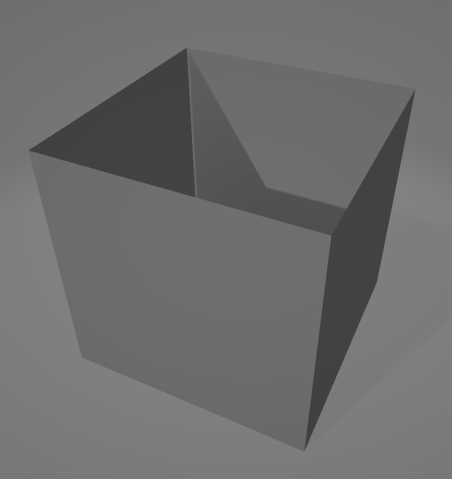
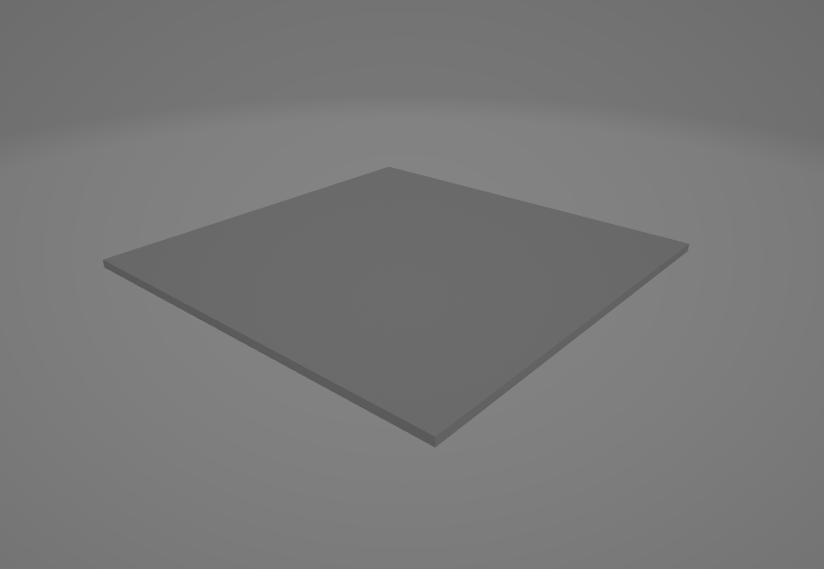
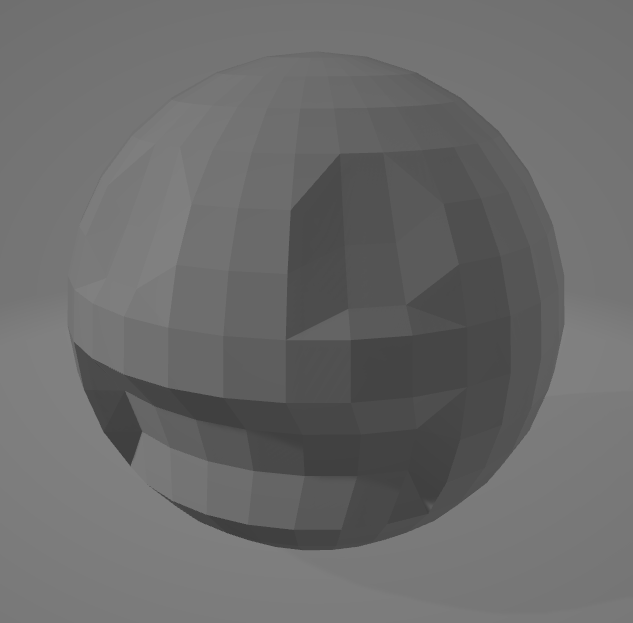
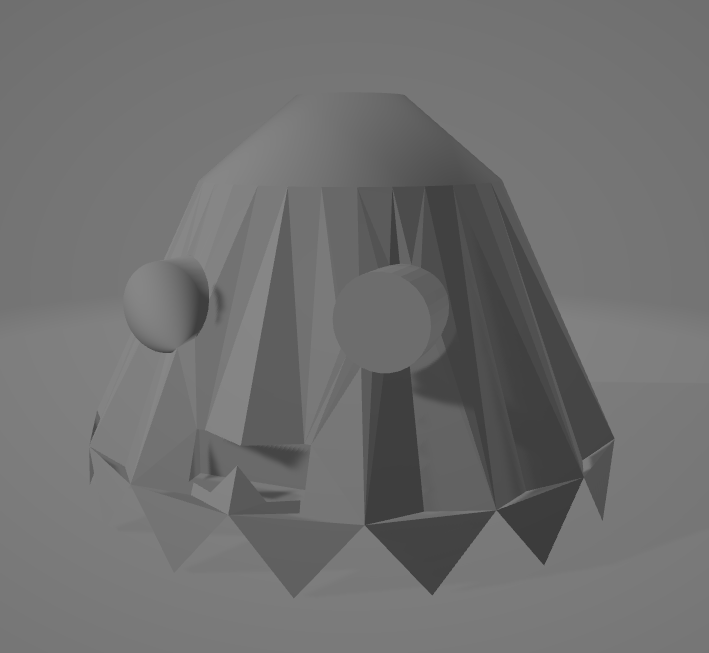
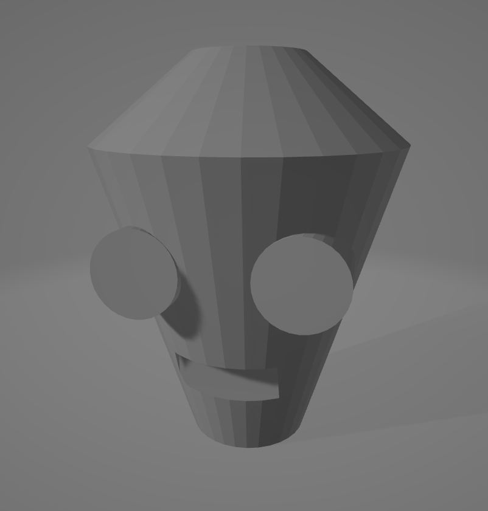
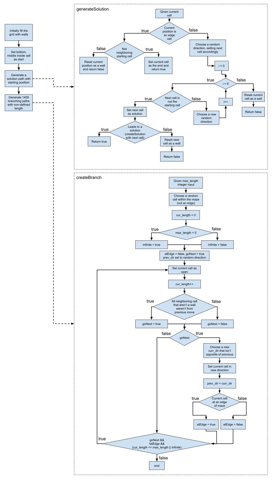

# Midterm Project - Spooky Maze in Space
Whitworth University - CS-357 Computer Graphics  
Last edited: 4/18/2021 by Andrew O'Kins

## Manual
### Welcome to the Spooky Maze in Space!  This is a simple program for demonstrating randomized maze generation with graphics and collision detections!

### Game Objective
To get out of the maze. The exit to the maze exit that is the only opening out of the maze.  Watch out for ghosts though! They scare you back to the start of the maze.

### Controls
The game is set in the first person perspective, but does not use the typical mouse look control scheme.  The following are the binding buttons.

#### Movement
`W` : Move forward 
`S` : Move backward 
`A` : Strafe left 
`D` : Strafe right 

#### Camera Controls
`UP` : Turn to look upward 
`DOWN` : Turn to look downward 
`LEFT` : Turn left 
`RIGHT` : Turn right 

#### Adjustment Controls
`-` : Decrease turn speed 
`=` : Increase turn speed 
`[` : Decrease movement speed 
`]` : Increase movement speed 

#### Additional Options
`F1` - Turn on wireframe mode <b>(technically cheating!)</b> 
`F2` - Turn off wireframe mode

### The Maze
The game starts you off at start point in the maze that is in the middle towards one side of the maze wall.  The maze is randomly generated each time but with a guranteed route of escape.  You'll find spaces with golden gears as the bread crumbs to the exit.  The maze follows a simple grid where spaces are either open or closed by being filled with walls.  You cannot pass through walls, only the visibly open spaces.

### Ghosts!
You aren't the only thing in the maze, you got to watch out for ghosts zipping around the maze!  Being ghosts, they move through the walls no problem but if they run into you then you will get spooked and start back at the start of the maze!  The ghosts follow randomized but predictable elliptical paths that you can use to navigate around them.

### Darkness
Note that the setting is in space, and space is a dark place.  Luckily you have a glowing lamp with you, but you're vision is limited as it gets darker further away from where you currently are.

### Escape!
When you escape the maze, you are free!  But space is pretty empty so I'm afraid you won't find much happening out there...

## Demo Link
We have two demo videos to show, one being a gameplay demo and another a sort of "Alpha" video to show some other perspective of the program.

Alpha Footage with comparisons using darkness or not as well as showing the older ghost models in use 
https://youtu.be/DDeP4iEjJCc 

Game Footage Demo (Description gives some of what's going on) 
https://www.youtube.com/watch?v=CyiQFxymIl0 

## Build Insturctions

The setup/build for our project follows the setup by Scott Griffith.  The steps involved requires CMake (https://cmake.org/) and MinGW to compile the code.  This requires in the main directory to run `cmake -G "MinGW Makefiles" -S . -B . -DCMAKE_INSTALL_PREFIX=C:\mingw-w64\mingw64\x86_64-w64-mingw32` to generate CMake files, and then to be able to actively build the code with `mingw32-make all`.  This creates a `main.exe` that can be run to start the program.

## Graphic Elements

The following are a series of images to show the current 3D models (without their textures) developed for this project.

### Wall Object
 
This is our object used in generating the walls of our maze grid.  Because our algorithm has a maze wall take up the same space as a pathway, a given wall contains four sides to block each direction.  Due to the player being unable to move up/down to see over or below the walls too, we do not need faces for those sides.

### Floor Tile
 
This is our object used in generating spaces of the maze that would allow the player to navigate through.  This tile is a simple box shape, though a notable characteristic is that it is offset from origin to -0.5 in the y direction.  This is so that in our render loop we can simply call to render it at the appriopriate cell without needing to offset the y translation for this specific object.  This object is used for both textured cells of normal open spaces and solution spaces.

### PacMan Ghost
 
This is our object used to reperesent the ghosts in the maze that the player must avoid.  This is a simple shape with subtle indents for eyes and mouth.

### Big Ghost (Currently Unused)
 
This is one of two objects made that were originally to be for representing ghosts in the maze.  However this along with the other with their more complex shapes did not work with our current methods of determing collisions and so due to time had to be dropped from being in the game.

### Thin Ghost (Currently Unused)
 
This is one of two objects made that were originally to be for representing ghosts in the maze.  However this along with the other with their more complex shapes did not work withour current methods of determing collisions and so due to time had to be dropped from being in the game.

### Flowchart

Here is a flowchart of the algorithms relating to creating a maze.  The general premise is to first initialize a completely filled maze, then create a valid solution, then fill the maze with opening "branches" that may or may not overwrite parts of the solution path (giving the desired breadcrumb effect).  There is an option for limiting possible length for a given branch, but our usage has it possibly infinite.

 
